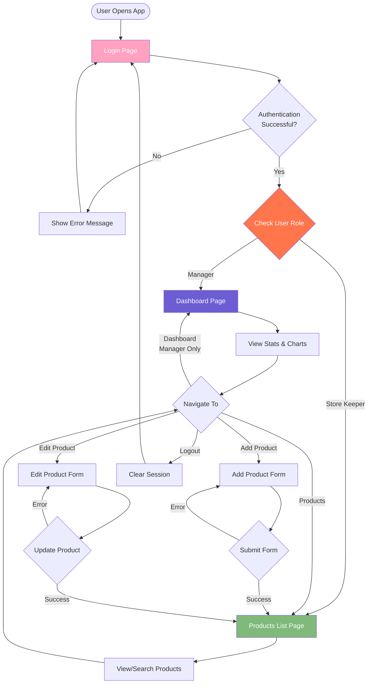

# Slooze Commodities Management Dashboard


> **Frontend Assignment Submission**  
> A comprehensive Commodities Management System designed to diversify product variety and streamline operations through a role-based dashboard.

---

## 🚀 Overview

This project is a React-based frontend application developed as part of the Slooze Take-Home Challenge. It implements a **Commodities Management System** featuring secure authentication, role-based access control (RBAC), and a dynamic dashboard for inventory management.

The application allows **Managers** to oversee sales statistics and inventory, while **Store Keepers** can manage product listings. The UI is modernized with a premium aesthetic, including a fully functional **Dark Mode**.

## ✨ Key Features

### 1️⃣ Authentication & Security
- **Secure Login**: User authentication with email and password.
- **Role-Based Access Control (RBAC)**: Secure routing and logic to differentiate between `Manager` and `Store Keeper` roles.
- **Session Management**: Persists user session with secure storage.

### 2️⃣ Dashboard & Analytics (Manager Only)
- **Stats Overview**: Real-time cards for Total Earnings, Views, Sales, and Subscriptions.
- **Data Visualization**: Interactive bar charts for sales performance and inventory tracking.
- **Recent Sales**: List view of recent transactions.

### 3️⃣ Product Management
- **Product List**: Searchable and filterable table with "Edit" and "Delete" actions.
- **Add Product**: Form with validation for creating new inventory items.
- **Edit Product**: Pre-filled form for updating existing product details.

### 4️⃣ UI/UX Enhancements
- **Theme Support**: Toggle between **Light** and **Dark** modes.
- **Responsive Design**: Fully optimized for desktop and tablet views.
- **Custom Branding**: Integrated Slooze brand identity (Logo, Typography, Colors).

---

## 📸 Screenshots

### Login Page

*Split-screen login with social authentication options*

### Dashboard (Manager View)

*Analytics dashboard with stats cards, charts, and recent sales*

### Product List

*Searchable product table with Edit/Delete actions*

### Add Product

*Two-column form layout for adding new products*

### Edit Product

*Pre-filled form for updating product details*

### Dark Mode

*Full dark theme support across all pages*

---
## 🛠️ Tech Stack

This project was built using the following technologies:

- **Frontend Framework**: React.js
- **Styling**: Tailwind CSS (Custom Configuration)
- **Icons**: React Icons (Feather, Material Design)
- **Charts**: Chart.js / React-Chartjs-2
- **State Management**: React Context API & Hooks
- **Mock Backend**: JSON Server (for REST API simulation)

---

## 🔒 Role-Based Access Rules

| Feature | Manager 🛡️ | Store Keeper 📦 |
| :--- | :---: | :---: |
| **Login** | ✅ | ✅ |
| **Dashboard Access** | ✅ | ❌ |
| **View Products** | ✅ | ✅ |
| **Add/Edit Products** | ✅ | ✅ |
| **Theme Switching** | ✅ | ✅ |

---

## � Application Flow

The following diagram illustrates the authentication and navigation flow based on user roles:



---

## �📦 Installation & Setup

Follow these steps to run the project locally:

### 1. Clone the Repository
```bash
git clone https://github.com/your-username/slooze-dashboard.git
cd slooze-dashboard
```

### 2. Install Dependencies
```bash
npm install
```

### 3. Start the Mock Server (Backend)
The application relies on `json-server` to mock API responses. Run this in a **separate terminal**:
```bash
cd mock
npm run server
```
*Server runs on `http://localhost:5000`*

### 4. Start the Frontend Application
In your main terminal, run:
```bash
npm start
```
*App runs on `http://localhost:3000`*

---

## 📂 Project Structure

```
src/
├── assets/          # Static assets (Logos, Images)
├── components/      # Reusable UI components (Layout, Cards)
├── context/         # Global State (Theme Context)
├── pages/           # Application Routes
│   ├── user/        # Login Page
│   ├── productInfo/ # Add/Edit/View Product Pages
│   └── dashboard.jsx
├── index.css        # Global Styles & Tailwind Imports
└── App.js           # Main Routing Configuration
```

---

## 👨‍💻 Author

**Sumit Kumawat**  
*Frontend Developer*

---

**© 2025 Slooze. All Rights Reserved.**
